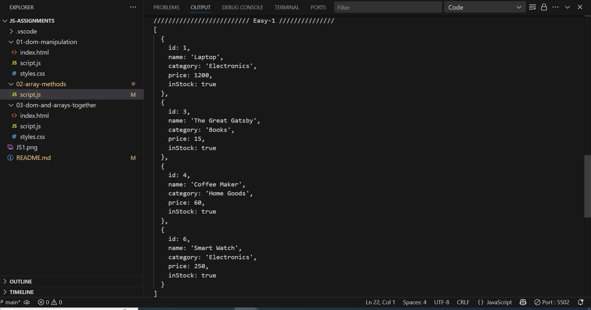
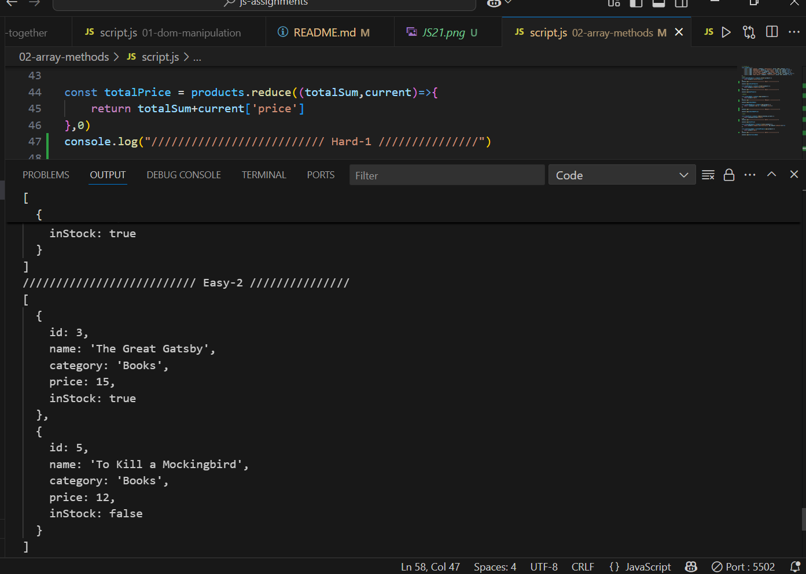
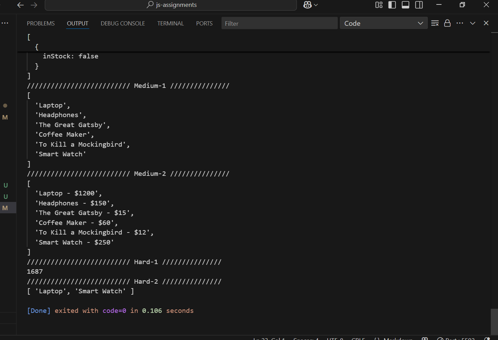

<h1> DAY - 2 </h1>

<h3> Assignment 1: DOM Manipulation Only </h3>

output screen

<b>Additional : Added email as href, clicking which will redirect to mail </b>

<h3>Assignment 2: Array Methods Only</h3>

<h6>Easy</h6>

Filter: Create a new array called inStockProducts that contains only the products that are inStock. Log it to the console.

Filter: Create a new array called bookProducts that contains only the products in the "Books" category. Log it to the console.

<h6>Medium -1, Medium -2, Hard -1, Hard -2</h6>

<h3>Assignment 3: Combining DOM & Array Methods</h3>

